

# 🌐 Enterprise Network Services Infrastructure

### Network Management and Administration Project

 

> *Design, deployment, integration, and validation of core enterprise network services within a fully virtualized infrastructure environment.*

---

## 📋 Table of Contents

* [Overview](#-overview)
* [Project Highlights](#-project-highlights)
* [Infrastructure Architecture](#-infrastructure-architecture)
* [Service Architecture](#-service-architecture)
* [Implemented Services](#-implemented-services)
* [Validation & Testing](#-validation--testing)
* [Project Gallery](#-project-gallery)
* [Technical Skills](#-technical-skills-demonstrated)
* [Key Learning Outcomes](#-key-learning-outcomes)
* [Documentation](#-documentation)
* [Author](#-author)

---

## 🔍 Overview

This project demonstrates the end-to-end design, deployment, integration, and validation of core enterprise network services within a virtualized infrastructure environment.

The environment was implemented using **Oracle VirtualBox** and consists of multiple Linux-based servers and clients configured to provide centralized network services including:

* Dynamic Host Configuration Protocol (DHCP)
* Enterprise Email Services (Zimbra Collaboration Suite)
* Active Directory Domain Services (Samba)
* Kerberos Authentication
* DNS Resolution
* Internal Web Hosting

The objective was to simulate a production-style enterprise infrastructure while gaining practical experience in Linux system administration, network service deployment, authentication management, infrastructure integration, and troubleshooting.

---

## 🚀 Project Highlights

* Multi-server virtualized enterprise infrastructure
* DHCP-based automated IP allocation
* Zimbra enterprise mail platform deployment
* Samba Active Directory Domain Controller implementation
* Kerberos-based centralized authentication
* Integrated DNS services
* Internal web hosting environment
* End-to-end service validation and testing
* Linux server administration and troubleshooting

---

## 🏗️ Infrastructure Architecture

### Network Configuration

| Component                   | Details           |
| --------------------------- | ----------------- |
| **Network Name**            | NMA-NET           |
| **Address Space**           | `192.168.6.0/24`  |
| **Domain Name**             | `IT06.LOCAL`      |
| **Virtualization Platform** | Oracle VirtualBox |

### System Inventory

| System               | Operating System    | Role                          | Services                        |
| -------------------- | ------------------- | ----------------------------- | ------------------------------- |
| **CentOS Server**    | CentOS 7            | Primary Infrastructure Server | DHCP Server, Zimbra Mail Server |
| **Ubuntu Server**    | Ubuntu Server 22.04 | Directory Services Server     | Samba AD DC, Kerberos, DNS      |
| **Ubuntu Client 01** | Ubuntu Desktop      | Domain Endpoint               | Domain User, Mail User          |
| **Ubuntu Client 02** | Ubuntu Desktop      | Domain Endpoint               | Domain User, Mail User          |

### Network Topology

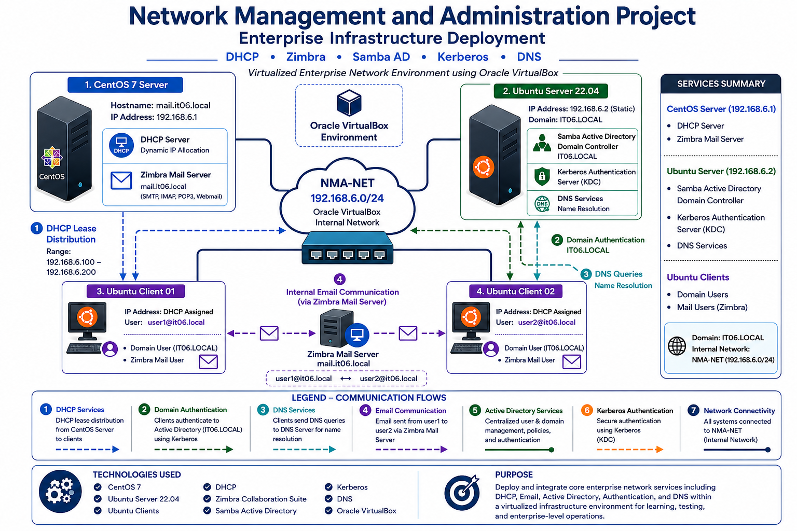

---

## 🔗 Service Architecture

| Service                 | Host          |
| ----------------------- | ------------- |
| DHCP Server             | CentOS Server |
| Zimbra Mail Server      | CentOS Server |
| Samba Active Directory  | Ubuntu Server |
| Kerberos Authentication | Ubuntu Server |
| DNS Services            | Ubuntu Server |
| Web Server              | Ubuntu Server |

---

## ⚙️ Implemented Services

### 📡 DHCP Server

Configured and deployed a DHCP service on CentOS 7 responsible for automated IP address allocation across the internal network.

#### Capabilities

* Dynamic IP allocation
* Address pool management
* Default gateway assignment
* DNS server assignment
* Lease management

---

### 📧 Zimbra Mail Server

Implemented a full-featured enterprise email solution using **Zimbra Collaboration Suite**.

#### Capabilities

* Webmail access
* User account management
* SMTP mail delivery
* IMAP and POP3 services
* Internal domain communication

---

### 🗂️ Samba Active Directory Domain Controller

Configured Samba as a full Active Directory Domain Controller providing centralized authentication and directory services.

#### Capabilities

* Domain management
* User administration
* Organizational Unit (OU) management
* Centralized authentication
* Security policy enforcement

---

### 🔐 Kerberos Authentication

Implemented Kerberos-based authentication for secure identity verification between domain clients and services.

#### Capabilities

* Secure ticket-based authentication
* Active Directory integration
* Single Sign-On (SSO)
* Centralized identity management

---

### 🌍 DNS Services

Configured integrated DNS services to support Active Directory and internal hostname resolution.

#### Capabilities

* Forward and reverse lookups
* Domain service discovery
* Internal name resolution

---

### 🌐 Web Server

Deployed and validated a web service accessible within the enterprise network environment.

#### Capabilities

* Internal web hosting
* Browser accessibility
* Service validation and testing

---

## ✅ Validation & Testing

All services were validated through systematic testing.

| Test Activity                        | Result   |
| ------------------------------------ | -------- |
| DHCP Lease Assignment Verification   | ✅ Passed |
| Network Connectivity Testing         | ✅ Passed |
| Active Directory Integration Testing | ✅ Passed |
| Domain User Authentication Testing   | ✅ Passed |
| Kerberos Authentication Validation   | ✅ Passed |
| DNS Resolution Verification          | ✅ Passed |
| Email Transmission Testing           | ✅ Passed |
| Email Reception Testing              | ✅ Passed |
| Web Server Accessibility Testing     | ✅ Passed |

---

## 🖼️ Project Gallery

<strong>🖥️ Virtualized Environment</strong>

 

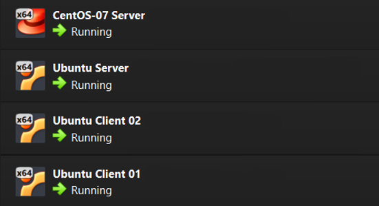

<strong>📡 DHCP Infrastructure</strong>

 

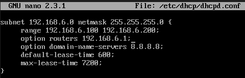

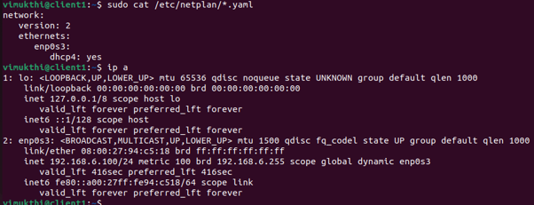

<strong>📧 Zimbra Mail Services</strong>

 

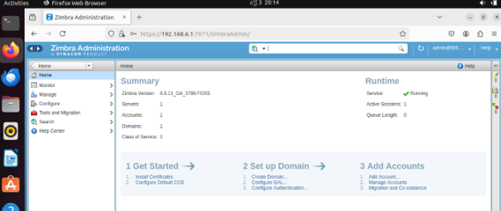

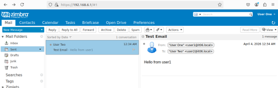

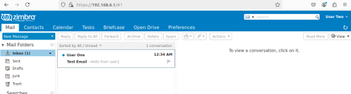

<strong>🗂️ Active Directory & Domain Services</strong>

 

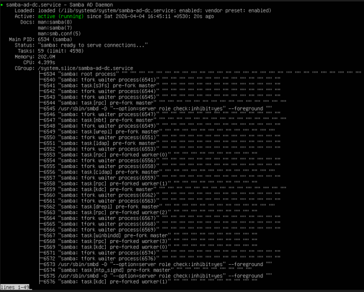

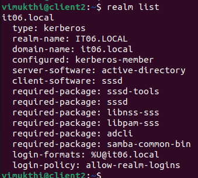

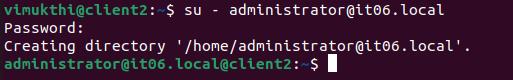

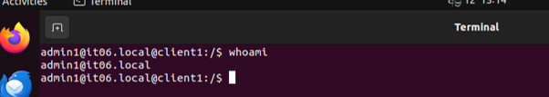

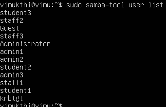

<strong>🌐 Web Services</strong>

 

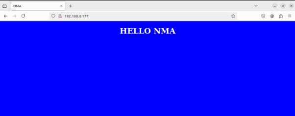

---

## 🛠️ Technical Skills Demonstrated

| Category               | Skills                                            |
| ---------------------- | ------------------------------------------------- |
| **Operating Systems**  | CentOS 7, Ubuntu Server 22.04, Ubuntu Desktop     |
| **Network Services**   | DHCP, DNS, Active Directory, Kerberos             |
| **Mail Services**      | Zimbra Collaboration Suite, SMTP, IMAP, POP3      |
| **Directory Services** | Samba AD DC, Domain Administration, SSO           |
| **Security**           | Kerberos Authentication, Access Control           |
| **Virtualization**     | Oracle VirtualBox, Multi-VM Networking            |
| **Administration**     | Linux CLI, Service Configuration, Troubleshooting |

---

## 📚 Key Learning Outcomes

Through this project, practical experience was gained in:

* Designing enterprise network infrastructures
* Deploying production-style network services
* Managing Linux-based server environments
* Implementing centralized authentication mechanisms
* Integrating multiple infrastructure services
* Troubleshooting service dependencies
* Validating end-to-end functionality
* Documenting enterprise deployments

---

## 📄 Documentation

Complete project documentation is available within the repository.

📘 **Project Report**

👉 [View Full Project Report](docs/NMA_Project_Report_Vimukthi_Siriwardana.pdf)

## 👤 Author

### Vimukthi Siriwardana

**BSc (Hons) in Information Technology**
**Specialising in Computer Systems and Network Engineering (CSNE)**

Sri Lanka Institute of Information Technology (SLIIT)

 

---

⭐ If you found this project interesting, feel free to explore the documentation and project artifacts.

